<div align="center">

<picture>
  <source media="(max-width: 700px) and (prefers-color-scheme: dark)" srcset="./assets/hero-compact.svg">
  <source media="(max-width: 700px)" srcset="./assets/hero-compact-light.svg">
  <source media="(prefers-color-scheme: dark)" srcset="./assets/hero.svg">
  <source media="(prefers-color-scheme: light)" srcset="./assets/hero-light.svg">
  
</picture>

<br/>

[](https://github.com/michealswolski/Automotive-ECU-Cybersecurity-Lab-/actions/workflows/ci.yml)
[](#the-six-projects)
[](#read-this-part-first)
[](./LICENSE)

[](https://michealswolski.github.io)
[](https://www.linkedin.com/in/michealwolski)
[](https://github.com/michealswolski)

<picture>
  <source media="(prefers-color-scheme: dark)" srcset="./assets/divider.svg">
  <source media="(prefers-color-scheme: light)" srcset="./assets/divider-light.svg">
  
</picture>

</div>

## What this is

An automotive product-security portfolio built as **one repository with six projects in it**, each covering a different slice of the lifecycle: threat analysis, secure boot, key management, in-vehicle communication security, network defence, and firmware validation.

Each project ships as a complete engineering package before a line of code exists — a technical specification, a phased build plan, and a definition of done that has to pass before the project counts as finished. That is deliberate. Writing the spec first is what separates *"I built a thing"* from *"I engineered a thing to a requirement and can prove it met one."*

<!-- labctl:begin totals -->

**6 projects · 56 core build phases (7 optional) · 114 acceptance criteria · 0 met so far.**

<!-- labctl:end totals -->

- 🎯 **Audience:** an automotive cybersecurity interviewer who will skim the README, run one command, and then ask what happens if they flip a bit.
- 🧪 **Method:** simulation-first, hardware-honest — every project says out loud which parts model hardware and which parts touch it (none).
- 🔗 **Composition:** the projects are designed to plug into each other. Two repos that compose beat three that don't.
- 📐 **Standards:** every project names the document it implements, and the [edition it cites is pinned, dated and enforced](#standards-traceability) — not recalled.

<div align="center">

<picture>
  <source media="(prefers-color-scheme: dark)" srcset="./assets/divider.svg">
  <source media="(prefers-color-scheme: light)" srcset="./assets/divider-light.svg">
  
</picture>

</div>

## Read this part first

> **Everything here is a simulation.** These projects model hardware behaviour in software. They do not touch an ECU, a transceiver, a real HSM, or a vehicle. No project in this repository is AUTOSAR-conformant, ISO-certified, independently reviewed, or production-grade — and each one says so in its own README as well.

That sentence is at the top on purpose, not buried in a footnote, because the alternative is having an interviewer find the gap themselves. A candidate who names the limits of their own work before being asked reads as an engineer. One who has to be caught reads as something else.

The discipline is enforced, not just stated. `lab.toml` records every capability the portfolio claims, and [`labctl validate`](./docs/tooling.md) fails the build if a project claims one of the five capabilities marked as requiring real hardware:

<!-- labctl:begin bench-gaps -->

| Capability | Claimed here? |
|---|---|
| Logic analyzer | No — requires hardware |
| JTAG / SWD on-target debugging | No — requires hardware |
| Oscilloscope | No — requires hardware |
| Vector CANoe | No — requires hardware |
| Physical CAN bus / transceivers | No — requires hardware |

<!-- labctl:end bench-gaps -->

Closing those gaps costs roughly $100 of hardware and a Saturday, and [`docs/bench-path.md`](./docs/bench-path.md) is the shopping list. Until then they stay unclaimed. The full policy — what to say, what not to say, and why — is in [`docs/honest-claims.md`](./docs/honest-claims.md).

<div align="center">

<picture>
  <source media="(prefers-color-scheme: dark)" srcset="./assets/divider.svg">
  <source media="(prefers-color-scheme: light)" srcset="./assets/divider-light.svg">
  
</picture>

## The six projects

<sub>Listed in recommended build order. Each links to its own specification, phased build plan, and interview talking points.</sub>

</div>

<!-- labctl:begin readme-projects -->

<table>
<tr>
<td width="50%" valign="top">

### `01` [Secure Boot Chain Simulator](./projects/secure-boot-chain-simulator)


A simulated multi-stage boot chain — BootROM to bootloader to application — where each stage cryptographically verifies the next before transferring control, over a hardware root of trust in OTP fuses and an HSM that never releases a private key.

**The demo that lands.** An image carrying a valid signature from the legitimate signing key that the chain still refuses to boot, because its security version number sits behind the monotonic counter.

<sub>8 phases + 2 optional · 17 acceptance criteria · <a href="./projects/secure-boot-chain-simulator/SPEC.md">spec</a> · <a href="./projects/secure-boot-chain-simulator/BUILD_PLAN.md">build plan</a> · <a href="./projects/secure-boot-chain-simulator/docs/interview-talking-points.md">talking points</a></sub>

</td>
<td width="50%" valign="top">

### `02` [CAN Bus SecOC Demo](./projects/can-secoc-demo)


An AUTOSAR Secure Onboard Communication implementation over a virtual CAN bus: AES-128 CMAC authenticators, the standard profiles with truncated MAC and truncated freshness value, receiver-side freshness reconstruction with an acceptance window, and resynchronisation.

**The demo that lands.** The same replay attack run twice. Unprotected, the receiver actuates on a stale brake command. SecOC-protected, the identical bytes are rejected, with the freshness window that was searched printed on screen.

<sub>9 phases + 1 optional · 17 acceptance criteria · <a href="./projects/can-secoc-demo/SPEC.md">spec</a> · <a href="./projects/can-secoc-demo/BUILD_PLAN.md">build plan</a> · <a href="./projects/can-secoc-demo/docs/interview-talking-points.md">talking points</a></sub>

</td>
</tr>
<tr>
<td width="50%" valign="top">

### `03` [ECU Key Lifecycle Manager](./projects/ecu-key-lifecycle)


The complete cryptographic key lifecycle for a simulated ECU fleet: generation in a backend HSM, HKDF derivation with per-generation domain separation, a challenge-response provisioning ceremony bound to a single ECU, fleet rotation with an overlap window, signed revocation lists, and a hash-chained audit log over every transition.

**The demo that lands.** Tampering with one byte of the audit log live and having the tool name the exact sequence number that broke the chain.

<sub>10 phases + 1 optional · 19 acceptance criteria · <a href="./projects/ecu-key-lifecycle/SPEC.md">spec</a> · <a href="./projects/ecu-key-lifecycle/BUILD_PLAN.md">build plan</a> · <a href="./projects/ecu-key-lifecycle/docs/interview-talking-points.md">talking points</a></sub>

</td>
<td width="50%" valign="top">

### `04` [ISO/SAE 21434 TARA Workbench](./projects/tara-workbench)


The Clause 15 TARA workflow run as version-controlled structured data rather than a spreadsheet — item definition through risk treatment, with computed risk determination, a thirteen-rule linter, and bidirectional traceability from any requirement back to the asset it protects.

**The demo that lands.** A complete worked TARA for an OTA-capable telematics gateway ECU, committed to the repo, passing its own linter in CI, with requirements that trace to test cases in the other projects.

<sub>9 phases + 1 optional · 17 acceptance criteria · <a href="./projects/tara-workbench/SPEC.md">spec</a> · <a href="./projects/tara-workbench/BUILD_PLAN.md">build plan</a> · <a href="./projects/tara-workbench/docs/interview-talking-points.md">talking points</a></sub>

</td>
</tr>
<tr>
<td width="50%" valign="top">

### `05` [In-Vehicle Network Security Lab](./projects/ivn-security-lab)


A simulated vehicle network spanning three protocols — LIN sub-bus, CAN-FD backbone, and Automotive Ethernet carrying SOME/IP-SD and DoIP — joined by a gateway ECU with a zone-based firewall, rate limiting, a diagnostic firewall and a threshold anomaly detector.

**The demo that lands.** The pivot: compromise a door module on the LIN bus and try to reach the brake ECU. Without zone policy you get all the way. With it you stop at the gateway.

<sub>10 phases + 1 optional · 22 acceptance criteria · <a href="./projects/ivn-security-lab/SPEC.md">spec</a> · <a href="./projects/ivn-security-lab/BUILD_PLAN.md">build plan</a> · <a href="./projects/ivn-security-lab/docs/interview-talking-points.md">talking points</a></sub>

</td>
<td width="50%" valign="top">

### `06` [ECU Firmware Security Validation Pipeline](./projects/ecu-firmware-validation)


A FreeRTOS application in C on an emulated ARM Cortex-M running a UDS diagnostic server behind an ISO-TP reassembler, with eight deliberately planted and documented vulnerabilities — wrapped in static analysis, sanitizers, coverage-guided fuzzing, SBOM generation and CVE scanning.

**The demo that lands.** The tool-comparison matrix: every planted bug against every tool, found or missed, with time-to-first-crash for the fuzzer. One vulnerability is chosen precisely because no automated tool catches it.

<sub>10 phases + 1 optional · 22 acceptance criteria · <a href="./projects/ecu-firmware-validation/SPEC.md">spec</a> · <a href="./projects/ecu-firmware-validation/BUILD_PLAN.md">build plan</a> · <a href="./projects/ecu-firmware-validation/docs/interview-talking-points.md">talking points</a></sub>

</td>
</tr>
</table>

<!-- labctl:end readme-projects -->

<div align="center">

<picture>
  <source media="(prefers-color-scheme: dark)" srcset="./assets/divider.svg">
  <source media="(prefers-color-scheme: light)" srcset="./assets/divider-light.svg">
  
</picture>

## How they compose

<sub>Six unrelated repositories demonstrate six things. Six that hand off to each other demonstrate systems thinking.</sub>

<picture>
  <source media="(prefers-color-scheme: dark)" srcset="./assets/portfolio-map.svg">
  <source media="(prefers-color-scheme: light)" srcset="./assets/portfolio-map-light.svg">
  
</picture>

</div>

Three hand-offs, and they are the reason the projects are in one repository instead of six:

| Hand-off | From | To | What crosses |
|---|---|---|---|
| **Requirements** | `04` TARA Workbench | every other project | Cybersecurity requirement IDs that tests trace back to. `tara trace REQ-014` prints the chain from a requirement down to the asset it protects. |
| **Authenticator** | `02` SecOC Demo | `05` IVN Security Lab | The gateway's SecOC enforcement point reuses the authenticator rather than reimplementing it badly. |
| **Key material** | `03` Key Lifecycle | `02` SecOC Demo | The lifecycle manager provisions the very MAC keys the SecOC bus consumes. |

Full narrative in [`docs/portfolio-map.md`](./docs/portfolio-map.md).

<div align="center">

<picture>
  <source media="(prefers-color-scheme: dark)" srcset="./assets/divider.svg">
  <source media="(prefers-color-scheme: light)" srcset="./assets/divider-light.svg">
  
</picture>

</div>

## Build order

The order is not arbitrary — each position is chosen so the previous project's output is available when the next one needs it, and so the cheapest credibility comes first.

<!-- labctl:begin build-order -->

| Order | Project | Why here | Effort |
|:---:|---|---|---|
| 1 | [Secure Boot Chain Simulator](./projects/secure-boot-chain-simulator) | Highest credibility per hour, and it stands alone. | a long weekend |
| 2 | [CAN Bus SecOC Demo](./projects/can-secoc-demo) | The most memorable demo; the authenticator is reused twice later. | a long weekend |
| 3 | [ECU Key Lifecycle Manager](./projects/ecu-key-lifecycle) | Provisions the MAC keys project 02 consumes — build the bridge. | a week of evenings |
| 4 | [ISO/SAE 21434 TARA Workbench](./projects/tara-workbench) | Needs real requirements to point at, so it wants the first three built. | a week of evenings |
| 5 | [In-Vehicle Network Security Lab](./projects/ivn-security-lab) | Reuses the SecOC enforcement point; building CAN-FD twice is waste. | a week of evenings |
| 6 | [ECU Firmware Security Validation Pipeline](./projects/ecu-firmware-validation) | The most expensive by far. Do it when the rest are shipping. | two weeks of evenings |

<!-- labctl:end build-order -->

Reasoning behind each position: [`docs/build-order.md`](./docs/build-order.md).

<div align="center">

<picture>
  <source media="(prefers-color-scheme: dark)" srcset="./assets/divider.svg">
  <source media="(prefers-color-scheme: light)" srcset="./assets/divider-light.svg">
  
</picture>

</div>

## Standards traceability

Naming ISO/SAE 21434 Clause 15 is a credibility multiplier. Naming AUTOSAR R20-11 in 2026 undoes it in one sentence. So the editions are not recalled — they are pinned in `lab.toml`, dated, and enforced.

<!-- labctl:begin project-standards -->

| # | Project | Implements |
|---|---|---|
| `01` | [Secure Boot Chain Simulator](./projects/secure-boot-chain-simulator) | SAE J3101, NIST SP 800-193, NIST SP 800-208, NSA CNSA 2.0, FIPS 204, UN ECE R156, ISO 24089 |
| `02` | [CAN Bus SecOC Demo](./projects/can-secoc-demo) | AUTOSAR SecOC, RFC 4493, NIST SP 800-38B, ISO 11898-1 |
| `03` | [ECU Key Lifecycle Manager](./projects/ecu-key-lifecycle) | NIST SP 800-57 Part 1, NIST SP 800-130, RFC 9162, UN ECE R156, ISO 24089 |
| `04` | [ISO/SAE 21434 TARA Workbench](./projects/tara-workbench) | ISO/SAE 21434, ISO/SAE PAS 8475, UN ECE R155 |
| `05` | [In-Vehicle Network Security Lab](./projects/ivn-security-lab) | ISO 11898-1, ISO 15765-2, ISO 14229-1, ISO 13400-2, LIN 2.2A / ISO 17987, IEEE 802.1AE (MACsec), AUTOSAR SecOC |
| `06` | [ECU Firmware Security Validation Pipeline](./projects/ecu-firmware-validation) | ISO/SAE 21434, ISO 14229-1, ISO 15765-2, MISRA C:2023, SEI CERT C, CycloneDX, SPDX, EU Cyber Resilience Act |

<!-- labctl:end project-standards -->

Every row of the [standards register](./docs/standards-register.md) records the edition to cite, when it was last checked, and against what. `labctl validate` fails the build if a project cites a standard that is not declared, cites one marked superseded, or cites nothing at all. `make standards` prints the register and flags what needs re-checking.

Two entries are under active revision right now — ISO/SAE 8475 (CAL/TAF) at final approval, and NIST SP 800-57 Part 1 with a Revision 6 draft out. Both are labelled as such rather than quoted as settled.

### What moved

The six specifications were drafted against an earlier snapshot of that landscape. [`docs/spec-corrections.md`](./docs/spec-corrections.md) is the delta, and each project carries its own build-facing checklist in `CORRECTIONS.md`. The five that matter most:

| Was | Is |
|---|---|
| ML-DSA as the post-quantum firmware-signing root | **CNSA 2.0 names LMS or XMSS** for firmware signing. ML-DSA-87 is for general signatures. |
| UDS security access is 0x27 seed/key | **ISO 14229-1:2020 added 0x29 Authentication**; ISO 15765-4 deprecates 0x27 for new designs. |
| AUTOSAR R20-11 / R21-11 | **R25-11**, released December 2025. |
| SBOM required by UN R155 or ISO/SAE 21434 | **Neither mandates one.** The EU Cyber Resilience Act does — the first binding SBOM mandate in law. |
| SAE J3101 is in development | **Published February 2020.** |

<div align="center">

<picture>
  <source media="(prefers-color-scheme: dark)" srcset="./assets/divider.svg">
  <source media="(prefers-color-scheme: light)" srcset="./assets/divider-light.svg">
  
</picture>

</div>

## Current status

Each project's `ACCEPTANCE.md` is its definition of done. This table is generated from those files, so it cannot flatter the repo — a project reads as complete only when every box in its own checklist is ticked.

<!-- labctl:begin readme-status -->

| # | Project | Status | Phases | Acceptance | Language |
|---|---|---|---|---|---|
| `01` | [Secure Boot Chain Simulator](./projects/secure-boot-chain-simulator) | ◻ Specified | 8 (+2) | 0/17 | Python |
| `02` | [CAN Bus SecOC Demo](./projects/can-secoc-demo) | ◻ Specified | 9 (+1) | 0/17 | Python |
| `03` | [ECU Key Lifecycle Manager](./projects/ecu-key-lifecycle) | ◻ Specified | 10 (+1) | 0/19 | Python |
| `04` | [ISO/SAE 21434 TARA Workbench](./projects/tara-workbench) | ◻ Specified | 9 (+1) | 0/17 | Python |
| `05` | [In-Vehicle Network Security Lab](./projects/ivn-security-lab) | ◻ Specified | 10 (+1) | 0/22 | Python |
| `06` | [ECU Firmware Security Validation Pipeline](./projects/ecu-firmware-validation) | ◻ Specified | 10 (+1) | 0/22 | C + Python |

<!-- labctl:end readme-status -->

<sub><b>Specified</b> — spec, build plan and acceptance criteria written; no implementation yet. <b>Building</b> — implementation under way. <b>Built</b> — every acceptance criterion met.</sub>

<div align="center">

<picture>
  <source media="(prefers-color-scheme: dark)" srcset="./assets/divider.svg">
  <source media="(prefers-color-scheme: light)" srcset="./assets/divider-light.svg">
  
</picture>

</div>

## Getting started

```bash
git clone https://github.com/michealswolski/Automotive-ECU-Cybersecurity-Lab-.git
cd Automotive-ECU-Cybersecurity-Lab-

make status                    # what is specified, building and built
make check                     # every consistency rule + the tool's own tests
make show PROJECT=can-secoc-demo   # phases, coverage and bridges for one project
```

`make status` needs nothing but Python 3.11+. There is no install step, no virtualenv, and no dependency to resolve — the repository tooling is deliberately zero-dependency so a reviewer can run it thirty seconds after cloning.

### Building one of the projects

Each project directory is a complete instruction set. To build one:

```bash
cd projects/secure-boot-chain-simulator
claude                         # then paste prompts/kickoff.md
```

`CLAUDE.md` holds the standing constraints, `SPEC.md` is the source of truth, `BUILD_PLAN.md` is the phase order, and `ACCEPTANCE.md` is the gate. Build one phase at a time and run the demo yourself after each one. The full workflow, including the phases that are genuine stop-and-verify gates, is in [`docs/building-a-project.md`](./docs/building-a-project.md).

<div align="center">

<picture>
  <source media="(prefers-color-scheme: dark)" srcset="./assets/divider.svg">
  <source media="(prefers-color-scheme: light)" srcset="./assets/divider-light.svg">
  
</picture>

</div>

## Repository layout

```
.
├── lab.toml                  # manifest — the single source of truth for every table below
├── projects/                 # the six projects, each a complete engineering package
│   └── <project>/
│       ├── CLAUDE.md         # standing constraints for the build
│       ├── SPEC.md           # technical specification — the source of truth
│       ├── BUILD_PLAN.md     # phases, each with its own acceptance criteria
│       ├── ACCEPTANCE.md     # the definition of done
│       ├── CORRECTIONS.md    # standards anchors that moved — read before building
│       ├── prompts/          # the kickoff prompt and follow-ups
│       └── docs/             # interview talking points and per-project notes
├── docs/                     # cross-cutting docs — standards register, claims policy, glossary
├── assets/                   # SVG graphics, generated from tools/assets/render_assets.py
├── site/                     # the GitHub Pages landing page
└── tools/
    ├── labctl/               # repository CLI — status, validate, render (+ its test suite)
    └── assets/               # the SVG generator
```

## Tooling

`labctl` exists because a portfolio that describes itself in six places will eventually describe itself six different ways. Every table in this README is generated from `lab.toml`, and CI fails if any of them drifts.

| Command | What it does |
|---|---|
| `make status` | Per-project phases, acceptance progress and effort |
| `make validate` | Every consistency rule — missing kit files, unresolvable skill or standard claims, a superseded edition still cited, dead links, a project marked done with work outstanding |
| `make standards` | The standards register, and which entries need re-checking |
| `make render` | Regenerate every table in the docs from the manifest |
| `make test` | The tooling's own test suite |
| `make assets` | Regenerate the SVGs in both themes |
| `make check` | Everything CI runs |

Details and the full rule list: [`docs/tooling.md`](./docs/tooling.md).

<div align="center">

<picture>
  <source media="(prefers-color-scheme: dark)" srcset="./assets/divider.svg">
  <source media="(prefers-color-scheme: light)" srcset="./assets/divider-light.svg">
  
</picture>

</div>

## Capability coverage

Which project demonstrates what. The full matrix, grouped by domain, is in [`docs/skills-coverage.md`](./docs/skills-coverage.md).

| Domain | Covered by |
|---|---|
| **Embedded trust** — secure boot, chain of trust, root of trust, anti-rollback, measured boot | `01` |
| **Cryptography** — AES, CMAC, PKI, key derivation, provisioning, rotation, revocation, audit | `01` `02` `03` |
| **Automotive networking** — CAN, CAN-FD, LIN, Automotive Ethernet, SOME/IP, DoIP, UDS, ISO-TP, SecOC | `02` `05` `06` |
| **Product security lifecycle** — ISO/SAE 21434, TARA, attack feasibility, requirements, traceability | `04` `06` |
| **Firmware engineering** — embedded C, FreeRTOS, static analysis, sanitizers, fuzzing, SBOM, CVE scanning | `06` |
| **Bench work** — logic analyzer, JTAG, oscilloscope, CANoe, physical CAN | *deliberately unclaimed — see [bench path](./docs/bench-path.md)* |

<div align="center">

<picture>
  <source media="(prefers-color-scheme: dark)" srcset="./assets/divider.svg">
  <source media="(prefers-color-scheme: light)" srcset="./assets/divider-light.svg">
  
</picture>

</div>

## Documentation

| Document | What it covers |
|---|---|
| [Portfolio map](./docs/portfolio-map.md) | How the six projects hand off to each other, and why that matters more than any one of them |
| [Build order](./docs/build-order.md) | Why each project sits where it does in the sequence |
| [Building a project](./docs/building-a-project.md) | The workflow for taking one project from specification to a working demo |
| [Standards register](./docs/standards-register.md) | The edition each project cites, when it was last checked, and against what |
| [Spec corrections](./docs/spec-corrections.md) | What moved in the standards landscape, and what each project must change |
| [Honest claims](./docs/honest-claims.md) | What to say about this work, what not to say, and the rule that decides |
| [Bench path](./docs/bench-path.md) | The hardware gaps, what closing each one costs, and what it converts a claim into |
| [Capability coverage](./docs/skills-coverage.md) | The full capability-by-project matrix |
| [Glossary](./docs/glossary.md) | The vocabulary, defined precisely — using the wrong term for a TARA step is the tell |
| [Tooling](./docs/tooling.md) | `labctl`, the manifest, the generated blocks, and every validation rule |
| [Status](./docs/status.md) | Generated progress detail |

<div align="center">

<picture>
  <source media="(prefers-color-scheme: dark)" srcset="./assets/divider.svg">
  <source media="(prefers-color-scheme: light)" srcset="./assets/divider-light.svg">
  
</picture>

## Related work

</div>

This lab is the automotive half of a wider security portfolio. Adjacent repositories: [Secure Boot Research](https://github.com/michealswolski/secure-boot-research) · [PKI & CA Research](https://github.com/michealswolski/pki-ca-research) · [OBD-II Diagnostic Scanner](https://github.com/michealswolski/obd2-diagnostic-scanner) · [AI Agent Governance](https://github.com/michealswolski/ai-agent-governance).

Background for the automotive work comes from a Product Cybersecurity internship at Bosch Mobility — secure boot research covering chain-of-trust verification and TPM-based attestation for automotive ECUs. Nothing in this repository contains confidential company information, internal data, source code, or proprietary material. These are independent implementations built from publicly available specifications.

<div align="center">

<picture>
  <source media="(prefers-color-scheme: dark)" srcset="./assets/divider.svg">
  <source media="(prefers-color-scheme: light)" srcset="./assets/divider-light.svg">
  
</picture>

## Let's Connect

<a href="https://michealswolski.github.io"></a>
<a href="https://www.linkedin.com/in/michealwolski"></a>
<a href="https://github.com/michealswolski"></a>

<br/><br/>

<sub><i>Trust · Verify · Ship — security that survives contact with production.</i></sub>

<br/>

<sub>MIT licensed · <a href="./LICENSE">LICENSE</a> · <a href="./CONTRIBUTING.md">Contributing</a> · <a href="./SECURITY.md">Security policy</a></sub>

</div>
